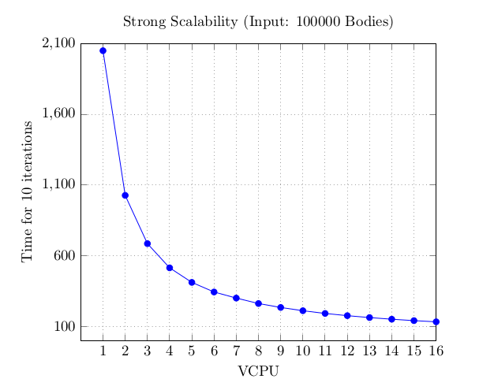
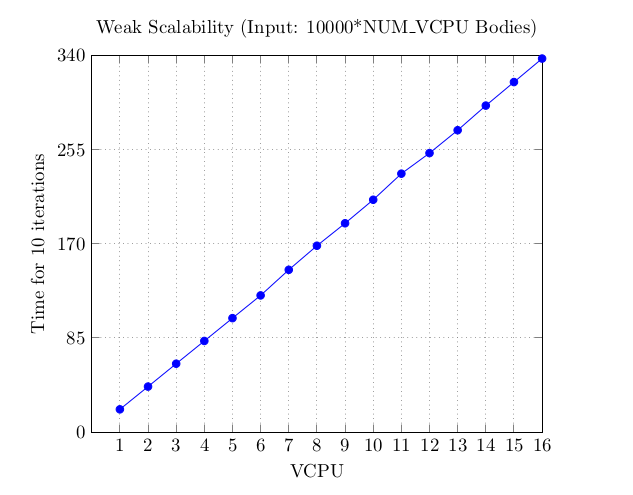

# Problema n-body
Il progetto contiene la soluzione al problema nbody. Sono presentate sia la soluzione sequenziale che quella parallela, ottenuta attraverso l'uso di Open MPI.
Nella soluzione parallela sono state utilizzate le funzioni MPI `MPI_Type_create_struct` per ottenere un nuovo datatype associato alla struttura che costituisce un body, `MPI_Scatterv` per mandare ad ogni processo un numero potenzialmente diverso di bodies, `MPI_Allgatherv` per aggiornare ogni processo con i nuovi dati computati dagli altri processi.

***

### Compilazione
Sono inclusi tre file sorgenti:
- bodiesGenerator.c: permette di generare un file che poi andrà in input al programma principale. Per compilarlo è sufficiente `gcc bodiesGenerator.c -o generator`. Il programma dovrà ricevere come argomento il numero di bodies da generare. Questo programma deve essere eseguito per primo per fornire il file di input per il programma principale;
- sequentialNBody.c: è il programma sequenziale. Va compilato con `gcc sequentialNBody.c -o sequential -lm`. Il programma dovrà ricevere come argomento il numero di iterazioni da effettuare;
- parallelNBody.c: è il programma parallelo. Va compilato con `mpicc parallelNBody.c -o parallel -lm`. Il programma dovrà ricevere come argomento il numero di iterazioni da effettuare.

Sia il programma sequenziale che quello parallelo daranno in output un file .txt contenente i dati aggiornati dei bodies. Per verificare la correttezza del programma parallelo è sufficiente confrontare i due file di output, i quali dovranno contentere gli stessi valori se eseguito sullo stesso file di input.

***

### Benchmark
I risultati presentati sono stati ottenuti eseguendo il programma su un cluster di 8 istanze AWS. Le istanze utilizzate sono di tipo t2.large (2 VCPU da 8 GB di memoria). I tempi riportati sono stati ottenuti passando "10" come argmento al programma sequenziale/parallelo (cioè facendo iterare 10 volte la simulazione dello spostamento dei bodies).

I risultati sono presentati in termini di strong scalability e weak scalability. In entrambi i casi è stato eseguito prima il programma sequenziale, per poi aumentare uno alla volta il numero delle VCPU utilizzate, fino ad arrivare a 16.
Nella tabella relativa alla strong scalability vengono mostrati anche lo speedup ottenuto (in accordo con la formula S(p,n)=T(1,n)/T(p,n)) e l'efficienza (in accordo con la formula E(p,n)=S(p,n)/p). Questi due valori non vengono mostrati nella tabella relativa alla weak scalability in quanto per calcolarli c'è bisogno che la taglia dell'input (n) tra il programma sequenziale e quello parallelo sia la stessa.

- **Strong Scalability:** per dimostrare che le performance del programma migliorano all'aumentare del numero di core se si mantiene lo stesso input, è stato utilizzato un file contenente 100000 bodies (`./generator 100000`). I risultati sono stati i seguenti:

|Input|# VCPUs|Tempo (s)|Speedup|Efficienza|
|---|---|---|---|---|
|100000|1|2049.910889|1|1|
|100000|2|1026.074656|1.99|0.99|
|100000|3|684.682742|2.99|0.99|
|100000|4|513.338277|3.99|0.99|
|100000|5|410.383827|4.99|0.99|
|100000|6|342.357378|5.98|0.99|
|100000|7|299.331733|6.84|0.97|
|100000|8|260.841742|7.85|0.98|
|100000|9|232.913106|8.80|0.97|
|100000|10|209.855216|9.76|0.97|
|100000|11|190.634925|10.75|0.97|
|100000|12|174.927809|11.71|0.97|
|100000|13|161.488951|12.69|0.97|
|100000|14|149.804514|13.68|0.97|
|100000|15|139.766334|14.66|0.97|
|100000|16|131.444039|15.59|0.97|

Il tempo impiegato dipende anche dalla latenza dovuta alla connessione, infatti, rieseguendo più volte l'algoritmo sullo stesso numero di VCPU, si ha una variazione in positivo o in negativo del tempo impiegato, che avvicinerà o allontanerà lo speedup al numero di VCPU utilizzate (nel caso ottimo lo speedup è proprio uguale al numero di VCPU utlizzate).

- **Weak Scalability:** per dimostrare come le performance del programma diminuiscono quando il numero di processi aumenta ma la taglia del problema per ogni processo rimane fissata, è stato utilizzato un file di input di 10000*NUM_VCPU bodies (1 VCPU 10000 bodies, 2 VCPUs 20000 bodies, ecc). I risultati sono stati i seguenti:

|Input|# VCPUs|Tempo (s)|
|---|---|---|
|10000|1|20.469170|
|20000|2|41.016116|
|30000|3|61.672547|
|40000|4|82.202443|
|50000|5|102.814669|
|60000|6|123.322674|
|70000|7|146.430306|
|80000|8|168.167909|
|90000|9|188.437299|
|100000|10|209.680120|
|110000|11|233.231589|
|120000|12|251.808139|
|130000|13|272.441458|
|140000|14|294.677063|
|150000|15|315.917237|
|160000|16|337.136267|
